<div align="center">

<picture>
  <source media="(prefers-color-scheme: dark)" srcset="https://readme-typing-svg.demolab.com?font=JetBrains+Mono&weight=500&size=24&duration=3000&pause=1000&color=FFFFFF&center=true&vCenter=true&width=600&lines=coldfinity;mathematics+%C3%97+computer+science">
  
</picture>

</div>

```text
┌─[coldfinity@github]─[~]
└──╼ $ whoami
```

```yaml
name: coldfinity
role: mathematics & computer science student
focus:
  - ai / ml — models, theory, and the math underneath
  - quantitative finance — stat arb, stochastic processes, time series
currently_building: dynabeta   # statistical arbitrage engine
```

## stack

<div align="center">


</div>

<br/>

```text
┌─[coldfinity@github]─[~]
└──╼ $ echo $PHILOSOPHY
"markets are stochastic. pick your battles."
```

```text
┌─[coldfinity@github]─[~]
└──╼ $ matrix
```


